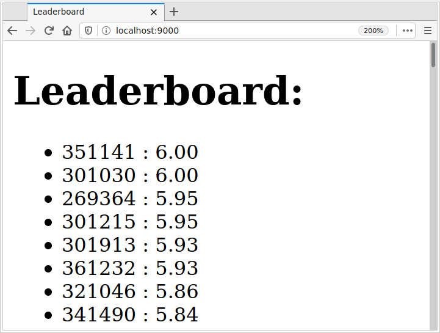

Use the following commands to make a fresh clone of your repository:

```
git clone -b f1 git@gitlab.epfl.ch:lamp/student-repositories-s21/cs206-GASPAR.git f1
```

## Useful links

  * [The API documentation of the Scala standard library](https://www.scala-lang.org/files/archive/api/2.13.4)
  * [The API documentation of the Java standard library](https://docs.oracle.com/en/java/javase/15/docs/api/index.html)
  * [The API documentation of the Play framework](https://www.playframework.com/documentation/2.8.x/api/scala/index.html)

**If you have issues with the IDE, try [reimporting the
build](https://gitlab.epfl.ch/lamp/cs206/-/blob/master/labs/example-lab.md#ide-features-like-type-on-hover-or-go-to-definition-do-not-work),
if you still have problems, use `compile` in sbt instead.**

## Exercise

In this exercise, your task is to implement a leaderboard webpage for a GitLab-based exam. This leaderboard is live in the sense that it is constructed on the fly by extracting grades directly from GitLab pipelines: it is always up to date.

This exercise uses the Play framework, a popular web application framework.
Play is entirely asynchronous and uses futures for concurrency.

In `src/main/scala/f1/MyComponents.scala`, we define a minimal Play application to display the leaderboard (you do not need to modify this file).

You can start this application using `sbt run` and open the leaderboard in a web browser at [http://localhost:9000/](http://localhost:9000/). After having completed this exercise, you should see a populated leaderboard as shown in this screenshot:



In this exercise, your task is to implement the `leaderboard()` method in `src/main/scala/f1/F1.scala` which asynchronously retrieves and sorts student grades.
Grades should be sorted such that maximum grades appear at the head of the list, like in the screenshot above.
Your implementation should use the following two methods to get the list of students and the grade of a particular student:

```scala
/** Retrieve a student's grade using GitLab's API */
def getGrade(sciper: Int): Future[Option[Grade]]

/** Retrieve the list of enrolled students from IS-academia */
def getScipers(): Future[List[Int]]
```

These methods have mock implementations that return made-up values after a short delay (simulating a network call).
Your implementation should be asynchronous (it is forbidden to use the `Await.result` method).
Furthermore, given the large number of students, calls to the GitLab API should be made in parallel such that the overall request is completed in about 1 second.

Your implementation should ignore students for which the get `getGrade` method returns a `None`.

*Hint:* this exercise can be solved without writing any recursive functions! You are allowed to use every function defined on [Future][1] and [List][2], as well as functions defined on their companion objects ([Future][3], [List][4]).

[1]: https://www.scala-lang.org/api/2.13.4/scala/concurrent/Future.html
[2]: https://www.scala-lang.org/api/2.13.4/scala/collection/immutable/List.html
[3]: https://www.scala-lang.org/api/2.13.4/scala/concurrent/Future$.html
[4]: https://www.scala-lang.org/api/2.13.4/scala/collection/immutable/List$.html
